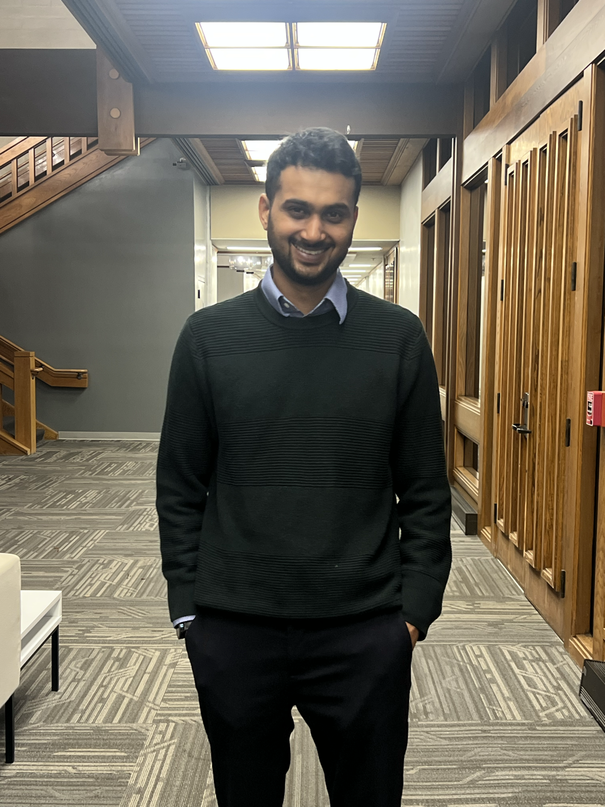
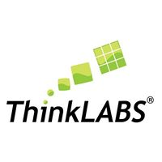
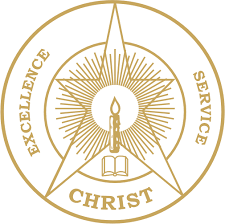

# About

!!! figure inline end
    

**Welcome!** I'm Akshay Malige, a physicist and FPGA/ML hardware engineer. I build detector readout electronics, FPGA-based data acquisition systems and accelerate ML algoritms on edge platforms for high-energy physics experiments, with contributions across <a href="https://www.dunescience.org/" target="_blank" rel="noopener">DUNE</a>, <a href="https://atlas.cern/" target="_blank" rel="noopener">ATLAS</a>, <a href="https://hades.gsi.de/" target="_blank" rel="noopener">HADES</a>, <a href="https://panda.gsi.de/" target="_blank" rel="noopener">PANDA</a>, and <a href="https://grams.sites.northeastern.edu/" target="_blank" rel="noopener">GRAMS</a>. I specialize in VHDL, HLS, hls4ml, Alveo and Versal ACAP platforms, with 40+ peer-reviewed publications.

Currently, I am a Post-doctoral Research Associate at <a href="https://www.bnl.gov/world/" target="_blank" rel="noopener">Brookhaven National Laboratory</a> working on ATLAS Event Filter tracking (ML on Xilinx Alveo) and a Versal ACAP based real-time (μs–s) feature extraction system.

**Links:** <a href="assets/cv.pdf" target="_blank" rel="noopener">CV</a> / <a href="https://scholar.google.com/citations?user=X3UKMuwAAAAJ&amp;hl=en" target="_blank" rel="noopener">Google Scholar</a> / <a href="https://github.com/akshaymalige" target="_blank" rel="noopener">GitHub</a> / <a href="https://www.linkedin.com/in/akshay-m-a9ba69b" target="_blank" rel="noopener">LinkedIn</a> / <a href="mailto:amalige@bnl.gov">Email</a>

## Snapshot

- **Current:** Postdoctoral Research Associate, Brookhaven National Laboratory
- **Focus:** FPGA DAQ, low-latency ML inference, Versal AIE-ML / Alveo platforms
- **Location:** Long Island, NY
- **Email:** [amalige@bnl.gov](mailto:amalige@bnl.gov)

## Work Experience

  
  

    
<strong>Brookhaven National Laboratory (BNL)</strong> — <em>Post-doctoral Research Associate</em>

    
Dec 2024 - Present · Upton, NY, USA

    
Working on FPGA-based ML for ATLAS Event Filter tracking and prototyping real-time alignment workflows on Versal ACAP.

    <ul>
      <li>Implementing low-latency inference with HLS and hls4ml on Xilinx Alveo and AMD Versal devices.</li>
      <li>Building a proof-of-concept alignment pipeline spanning AI Engine tiles, programmable logic, and the ARM processing system (VEK280).</li>
    </ul>
  

  
  

    
<strong>Columbia University (Nevis Laboratories)</strong> — <em>Post-doctoral Research Scientist</em>

    
Jul 2023 - Dec 2024 · New York, NY, USA

    
Developed FPGA firmware and ML acceleration pipelines for neutrino experiments and supported the GRAMS TPC readout effort.

    <ul>
      <li>Implemented real-time data compression and anomaly detection on FPGA for DUNE and MicroBooNE workflows.</li>
      <li>Served as technical coordinator for NASA-APRA <a href="https://news.columbia.edu/news/using-new-balloon-borne-technology-probe-deeper-our-dark-universe">GRAMS</a>, supporting design reviews and multi-institution integration of the FPGA-based readout system.</li>
    </ul>
  

  
  

    
<strong>Hitachi Energy</strong> — <em>R&amp;D Product Engineer (FPGA Developer)</em>

    
Feb 2023 - Jun 2023 · Krakow, Poland

    
Developed and verified FPGA logic for HVDC converter control systems.

    <ul>
      <li>Wrote VHDL modules and testbenches for control and protection functions.</li>
      <li>Ran timing analysis and verification to support integration into converter control hardware.</li>
    </ul>
  

  
  

    
<strong>AGH University of Science and Technology</strong> — <em>Research Assistant (Ph.D. Researcher)</em>

    
Jan 2022 - Feb 2023 · Krakow, Poland

    
Worked on real-time DAQ and detector prototyping for HADES and PANDA tracking systems.

    <ul>
      <li>Developed data filtering and trigger logic modules and interfaced detector electronics with the readout framework.</li>
      <li>Built and tested a PANDA straw tube tracker prototype, including front-end signal processing and calibration for beam tests.</li>
      <li>Implemented remote control and monitoring tools for HADES detector subsystems to support stable operation during runs.</li>
    </ul>
  

  

    
  

  

    
<strong>ThinkLabs Technosolutions</strong> — <em>Training Specialist</em>

    
Nov 2016 - Sep 2017 · Bangalore, India

    
Delivered STEM workshops across India for instructors and students, covering basic electronics, robotics, and physics experiments.

    <ul>
      <li>Reached 100+ instructors and 1000+ students through hands-on training sessions.</li>
      <li>Developed curriculum and trained instructors in science communication and demonstration techniques.</li>
    </ul>
  

## Education

  
  

    
<strong>Jagiellonian University</strong> — <em>Ph.D. in Physics</em>

    
2017 - 2023 · Krakow, Poland

    

      Thesis: "Read-out and online data processing for the Forward Tracker in HADES and PANDA." Focused on FPGA-based DAQ and real-time processing.
      <a href="https://ruj.uj.edu.pl/server/api/core/bitstreams/98b5d691-ee85-4593-94e9-b784fa790547/content" target="_blank" rel="noopener">PDF</a>
    

  

  
  

    
<strong>Christ University</strong> — <em>M.Sc. in Physics</em>

    
2014 - 2016 · Bangalore, India

    
Thesis: "Influence of short-wave and long-wave radiation on local weather."

  

  

    
  

  

    
<strong>Mangalore University</strong> — <em>B.Sc. in Physics, Electronics, Mathematics</em>

    
2011 - 2014 · Mangalore, India

  

## Research Projects

- **Real-time Alignment on Versal ACAP** (BNL LDRD, 2025)  
  Heterogeneous pipeline on AMD Versal VEK280 (AI Engine + PL + PS) for on-the-fly detector alignment and calibration. Links: <a href="https://indico.cern.ch/event/1499357/contributions/6628604/" target="_blank" rel="noopener">Talk</a> / <a href="https://indico.cern.ch/event/1488410/contributions/6562892/" target="_blank" rel="noopener">Poster</a>
- **ATLAS ML Trigger** (2024 - Present)  
  HLS/hls4ml kernels on Xilinx Alveo U250 for Event Filter tracking; optimized for latency and throughput. Migration of the Event Filter tracking pipeline to Versal VCK190, VEK280, VP1552 platforms (from data-center card to embedded accel).
- **FPGA Accelerated Trigger for DUNE** (2023)  
  Implemented 2D CNN-based trigger and feature extraction firmware for large-scale neutrino detectors.
- **Anomaly Detection on FPGA** (2023)  
  Autoencoder-based data quality monitoring on Xilinx Alveo boards for streaming liquid argon TPC data. Links: <a href="https://arxiv.org/abs/2509.21817" target="_blank" rel="noopener">Paper (arXiv)</a> / <a href="https://github.com/AkshayMalige/Nevis_LarTPC_anamoly_alveo" target="_blank" rel="noopener">Code (GitHub)</a>
- **GRAMS TPC Readout** (2023)  
  Lead for FPGA DAQ, slow control, and system integration for the balloon-borne gamma-ray experiment.
- **PANDA Straw Tracker DAQ** (2019 - 2022)  
  FPGA readout, online processing, and calibration for PANDA straw tube tracker (Ph.D. thesis). Link: <a href="https://ruj.uj.edu.pl/server/api/core/bitstreams/98b5d691-ee85-4593-94e9-b784fa790547/content" target="_blank" rel="noopener">Thesis (PDF)</a>

## Conference Presentations & Workshops

- Connecting the Dots (CTD 2025), University of Tokyo, Nov 10-14, 2025 — Talk: "Real time inference on heterogeneous devices for detector calibration." <a href="https://indico.cern.ch/event/1499357/contributions/6628604/" target="_blank" rel="noopener">Talk</a> / <a href="https://indico.cern.ch/event/1499357/" target="_blank" rel="noopener">Event</a>
- ACAT 2025, University of Hamburg, Sep 8-12, 2025 — Poster: "Accelerating Detector Alignment Calibration with Real-Time Machine Learning on Versal ACAP Devices." <a href="https://indico.cern.ch/event/1488410/contributions/6562892/" target="_blank" rel="noopener">Poster</a> / <a href="https://indico.cern.ch/event/1488410/" target="_blank" rel="noopener">Event</a>
- US ATLAS HLS Education and Development (AHEAD) Bootcamp, Brookhaven National Lab, June 9–13, 2025 — Co-organizer; developed FPGA HLS training materials and instructed 30+ participants. <a href="https://indico.cern.ch/event/1500540/" target="_blank" rel="noopener">Event</a> / <a href="https://github.com/AkshayMalige/AHEAD_2025/tree/main?tab=readme-ov-file" target="_blank" rel="noopener">Tutorial page</a>
- European AI for Fundamental Physics Conference (EuCAIFCon), Amsterdam, Apr 30 – May 3, 2024 — Poster presenter on FPGA-based anomaly detection. <a href="https://indico.nikhef.nl/event/4875/contributions/20460/" target="_blank" rel="noopener">Contribution</a>
- Neutrino Physics and Machine Learning Workshop, Tufts University, Aug 22-25, 2023. <a href="https://indico.ipmu.jp/event/462/" target="_blank" rel="noopener">Event</a>
- Xilinx Adaptive Compute Ph.D. School, ETH Zurich, Jan 24-28, 2022.
- FAIRNESS 2019 (Arenzano), MESON 2018 (Krakow), and earlier conferences.

## Selected Publications

### Real-time Anomaly Detection for Liquid Argon Time Projection Chambers

*Chung, Seokju, Cleeve, Jack, Malige, Akshay, Karagiorgi, Georgia, Gerlach, Lino, Pol, Adrian A., Ojalvo, Isobel*

*arXiv preprint arXiv:2509.21817, 2025*

[arXiv](https://arxiv.org/abs/2509.21817)

---

### Comparison of readout systems for high-rate silicon photomultiplier applications

*Wong, M. L., Kołodziej, M., Briggl, K., Hetzel, R., Korcyl, G., Lalik, R., Malige, A.*

*Journal of Instrumentation, 2024*

[Journal](https://doi.org/10.1088/1748-0221/19/01/P01019)

---

### Read-out and online processing for the Forward Tracker in HADES and PANDA

*Malige, Akshay*

*Jagiellonian University, 2023*

---

### Production tests of front-end electronics for Straw Tube Trackers in HADES and PANDA experiments at FAIR

*Firlej, Mirosł*

*Journal of Instrumentation, 2023*

[Journal](https://doi.org/10.1088/1748-0221/18/05/P05008)

---

### Real-Time Data Processing Pipeline for Trigger Readout Board-Based Data Acquisition Systems

*Malige, A., Korcyl, G., Firlej, M., Fiutowski, T., Idzik, M., Korzeniak, B., Lalik, R.*

*IEEE Transactions on Nuclear Science, 2022*

[Journal](https://doi.org/10.1109/TNS.2022.3168889)

---

### Hyperon studies and development of forward tracker for hades detector

*Rathod, Narendra, Lalik, Rafał*

*arXiv preprint arXiv:2004.09387, 2020*

[arXiv](https://arxiv.org/abs/2004.09387)

---

### Measurement of signal-to-noise ratio in straw tube detectors for PANDA forward tracker

*Rathod, Narendra, Smyrski, Jerzy, Malige, Akshay*

*Basic Concepts in Nuclear Physics: Theory, Experiments and Applications, 2019*

---

<a href="publications/">Full Publication List</a>

## Skills

- **Hardware/HDL:** FPGA design (VHDL/Verilog), RTL logic, high-speed serial links, timing closure, PCB schematic capture.
- **HLS/ML:** Vivado HLS, Vitis HLS, hls4ml, AI Engine (AIE, AIE-ML), DPU.
- **Platforms:** Xilinx Alveo U55c/U250/U280, Versal VEK280, VCK190, VP1552, PYNQ-Z2, ZCU104, ZCU102, KU15P, Lattice ECP3/ECP5.
- **Software:** Python, C/C++, MATLAB, Bash, Git, Linux, ROOT, Docker.
- **Frameworks/Tools:** PyTorch, TensorFlow, PYNQ, OpenCAPI, XRT, Vitis AI; Vivado, Vitis, ModelSim, HLS Profiler, Vitis Analyzer, Lattice Diamond, Quartus.
- **Languages:** English (fluent), Hindi (advanced), Kannada (native), basic Polish.

## Honors & Grants

- POLONEZ Postdoctoral Fellowship - National Science Centre (Poland), Hyperon production studies (2016/23/P/ST2/04066).
- Marie Sklodowska-Curie COFUND Fellowship (contributing researcher) - EU Horizon 2020 (Grant 665778).
- University Research Grants - Jagiellonian University (MNS Grants for Young Scientists, 2019 and 2020).
- Outstanding Working Group Award - PANDA@HADES Collaboration (2022) for tracking and readout development.
